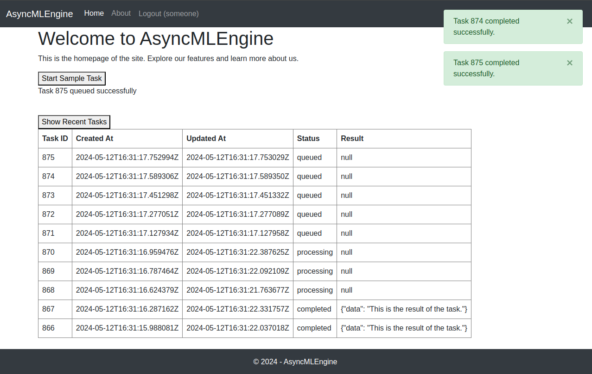

# Tasks

- [x]  User authentication
    - [x]  Base page, Home page, and About page
    - [x]  User login
    - [x]  New user signup
    - [x]  Logout API endpoint
    - [x]  Display user's username in the navigation bar if they're logged in
- [x]  Websocket connection with user authentication
    - [x]  Establish websocket connection on page load if authenticated
    - [x]  Test the websocket for sending and receiving messages
    - [x]  Setup redis channel for distributed service
- [x]  REST API call to queue workload asynchronously
- [x]  Celery worker for processing workload from queue
- [x]  Notification upon completion of the async workload

# UI screenshot

# Components

## 1. Django Service:
### 1.1 API Service:
   - Enqueue workloads asynchronously from a queue.
   - Task model for maintaining task status and results.
   - Retrieve recent tasks for the user.
### 1.2 UI Service:
#### 1.2.1 Home Page:
   - Button to queue tasks.
   - Fetch and display recent tasks for the user.
   - Live notifications when tasks are completed.
#### 1.2.2 About Page:
   - Information about the service and its functionalities.
### 1.3 Auth Service:
   - Signup, signin, and logout UI and APIs.
   - Open a websocket upon authorization for sending real-time notifications to the user.
   - Pull messages from the user channel and notify the user over the websocket.

## 2. Background Worker:
### 2.1 Task Service:
   - Dequeue workload from the queue, start processing, and store the result in the database.
   - Send messages to the user channel to notify the user when a task is completed.

# Tech Stack

1. **Framework**: Django + Django Channels + Celery
2. **RabbitMQ**: Celery broker for the async tasks execution in the background.
3. **Redis**: Django Channels backend for distributed messaging between the background task and channel service.
4. **PostgreSQL**: Database for maintaining users and Celery backend for maintaining tasks.

